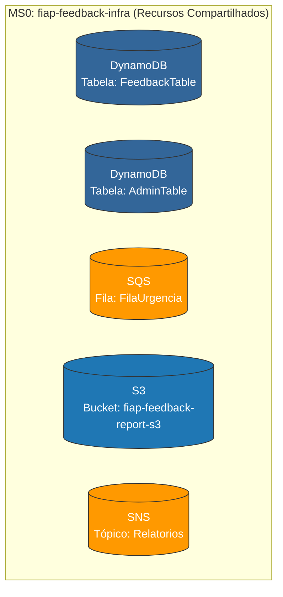
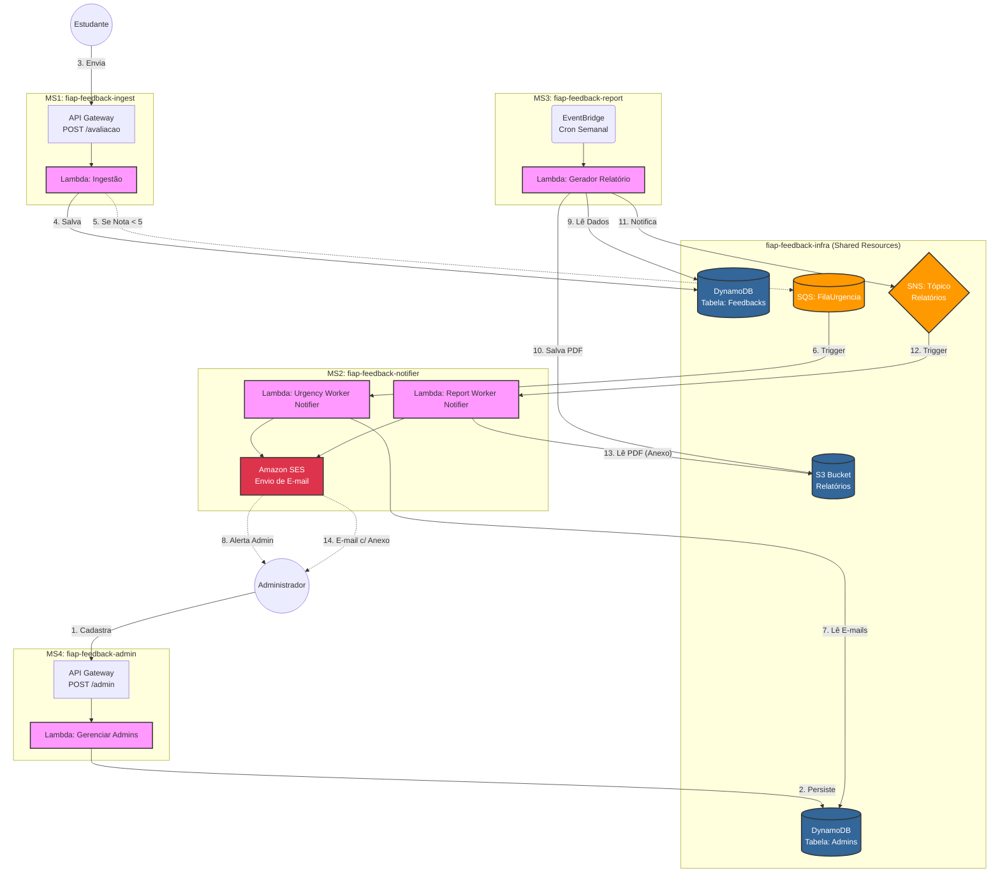

# FIAP Feedback Infra

Este repositório contém a infraestrutura compartilhada entre os microsserviços da Plataforma de Feedback, utilizando o AWS SAM (Serverless Application Model).

## 🚀 Tecnologias Utilizadas
*   **AWS SAM (Serverless Application Model)**: Para IaC (Infraestrutura como Código) e deploy.
*   **AWS CloudFormation**: A tecnologia subjacente usada pelo AWS SAM.

## ⚙️ Pré-requisitos
*   AWS CLI configurado com suas credenciais.
*   AWS SAM CLI instalado.

## 📦 Como Fazer o Deploy
**1. Valide o template SAM:**
```bash
sam validate --template-file template.yaml --region us-east-1
```

**2. Execute o deploy da stack:**
```bash
sam deploy --stack-name fiap-feedback-infra --region us-east-1
```

**3. Deletar template**
```
sam delete --stack-name fiap-feedback-infra
```
> **Importante:** O comando `deploy` fará o provisionamento ou atualização dos recursos na AWS de acordo com o `template.yaml`.

### Recursos Compartilhados entre os microsserviços

- MS1: https://github.com/MarcosBerto66/fiap_20252_servico_feedback_ingestao
- MS2: https://github.com/EmmanuellaAlbuquerque/fiap-feedback-notifier
- MS3: https://github.com/mainmtd/fiap-feedback-report-generator
- MS4: https://github.com/EmmanuellaAlbuquerque/fiap-feedback-admin



### Diagrama completo de todos os microsserviços



---
**Desenvolvido para o Tech Challenge da FIAP - Fase de Cloud Computing & Serverless.**

